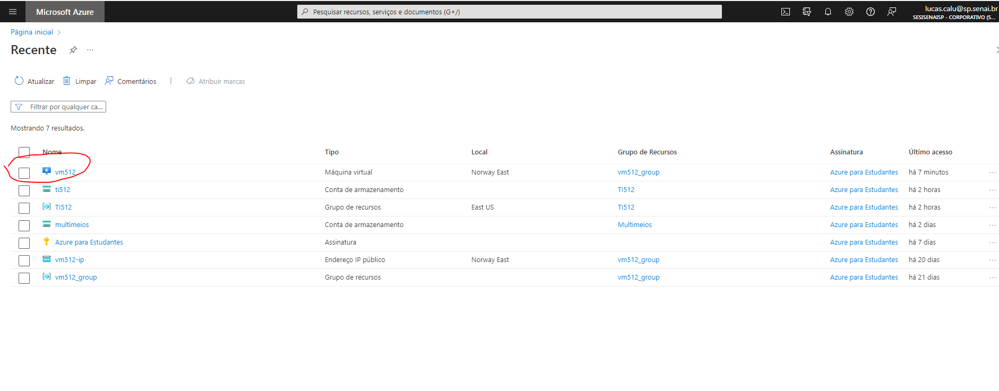
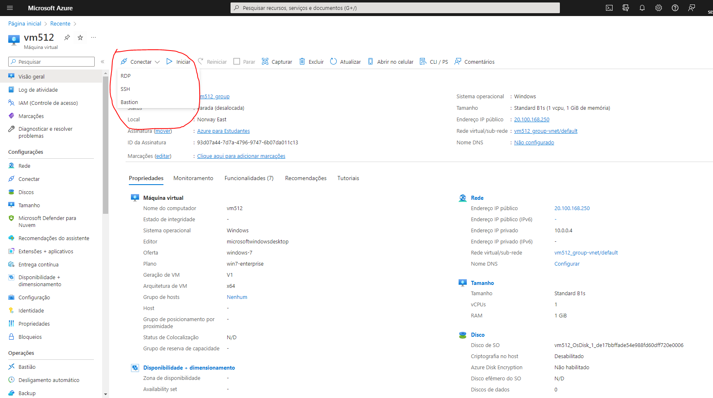
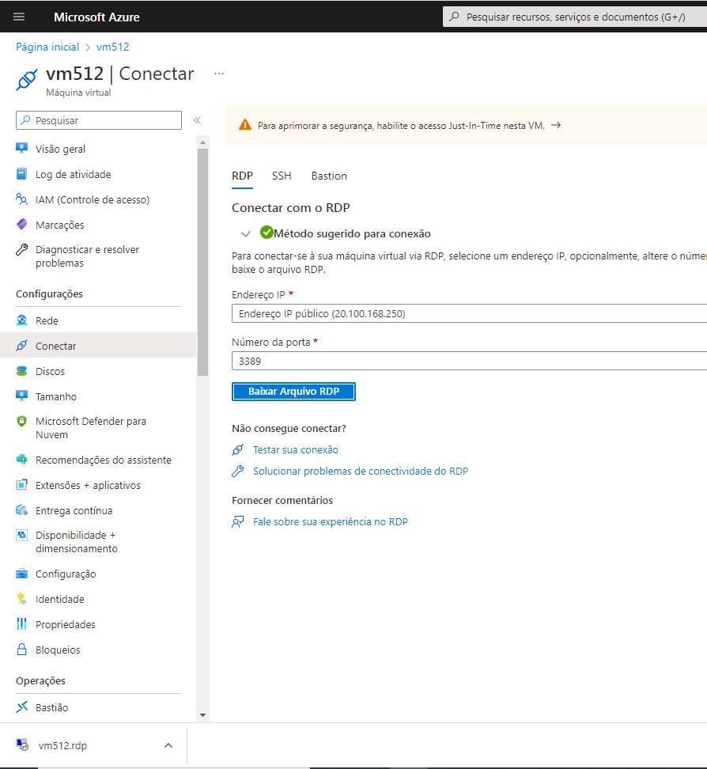
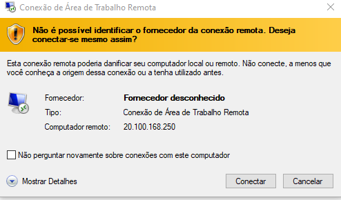

# AZ-900-INSTALL-SERVER-APACHE-IN-VM

Acesse https://portal.azure.com/#home

Dentro da guia recursos procure por sua máquina virtual

Verifique se a máquina virtual foi iniciada e clique em conectar para acessa-la

Acesse o link https://www.apachefriends.org/download.html e siga as instruções para instalar o servidor apache em sua máquina virtual

# Parabéns você instalou um servidor apache na usa máquina virtual com sucesso!

